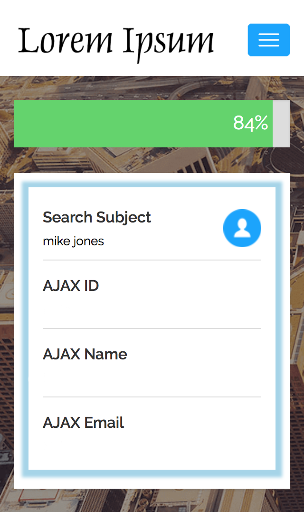

# Overview
We would like you to create a "tour" which imitates the majority of tasks you will be working on with us. You can use any tools you wish to complete it. Any images you need are in the assets folder. Please send your results as a [git patch](https://ariejan.net/2009/10/26/how-to-create-and-apply-a-patch-with-git/).

# Requirements

## Landing page:
- When it opens you should land on this page
- The links in the header just need to be styled, no functionality needed. The login link needs to have a white background and blue text when hovered or active.
- On mobile the hamburger menu should make the nav with the links dropdown
- For the form, the first and last name fields should be required. State is optional.
- If the user hasn't entered anything, an error message should come up saying "Please enter your first name" or similar, and the form fails to submit (front end validation only)
- Submitting the form successfully should send the user to the the next page, passing the first, last, and state values in the url




## Searching page:
- When the user lands here, a loading bar initiates with the progress percentage inside
- the Search Subject section will be autofilled with the first, last, and state values from the url
- As it loads, an AJAX call will be made to https://jsonplaceholder.typicode.com/, and you will use the response from that to gradually fill the remaining AJAX fields in the box every 5 seconds (or any time interval you like)



## Results page:
- When the loader is done, it will be hidden and an Open Report button will fade in in its place and all the fields filled

## Other:
- Usage of bundlers, CSS preprocessors and task runners is encouraged 
- The pages should be responsive, though mobile will be focused on most
- Remember this is a mobile­based web­app, so it should be compatible with major browsers (Safari, Chrome, Firefox, Opera).
- Please provide a short summary detailing anything you think is relevant, for _example_:
  - Installation steps
  - How to run your code / tests
  - Where to find your code
  - What would you have done differently if you had had more time
  - Etc.
